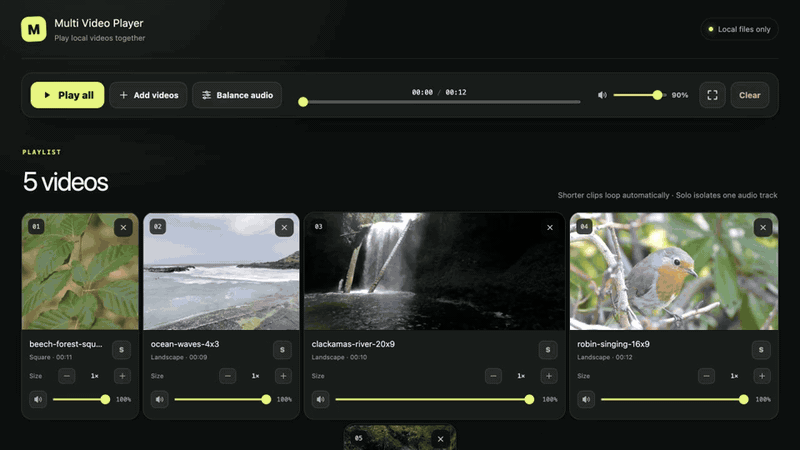

# Multi Video Player

Play local videos side by side on one timeline. Nothing is uploaded and no
account is needed.

[Try Multi Video Player in your browser](https://induction-axiom.github.io/multi-video-player/)



Drop in any mix of landscape, portrait, square, or ultrawide clips. The player
keeps them in sync, loops shorter clips, and fits every frame without cropping.

## Screens

| Choose files | Play together | Fullscreen |
| --- | --- | --- |
|  |  |  |

## What it does

- One play button and timeline for every video
- Automatic layouts for mixed aspect ratios
- Per-video display sizes that keep halving or doubling between a usable
  180px control width and the available layout width
- Per-video volume, mute, solo, and audio balancing
- Fullscreen video wall
- Local-only playback

## Run it

Requires Node.js 22.13 or newer.

```bash
npm install
npm run dev
```

Open the local address printed in the terminal, then drop in your videos.
Format support depends on the browser; MP4, MOV, and WebM usually work.

## Online version

The hosted player runs entirely in your browser. Selected videos stay on your
device and are not uploaded:

<https://induction-axiom.github.io/multi-video-player/>

## Development

```bash
npm test
npm run lint
```

## Improve the layout algorithm

Edit [`algorithm/video-layout.ts`](algorithm/video-layout.ts), then compare the
results before and after your change:

```bash
npm run test:layout
npm run benchmark:fill
```

`P05 fill` and `worst fill` should go up; `P95 black` should go down. The
benchmark generates 5,000 repeatable aspect-ratio combinations by default.

MIT licensed.
