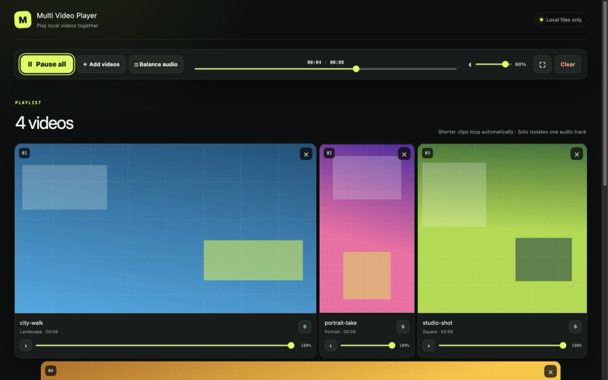
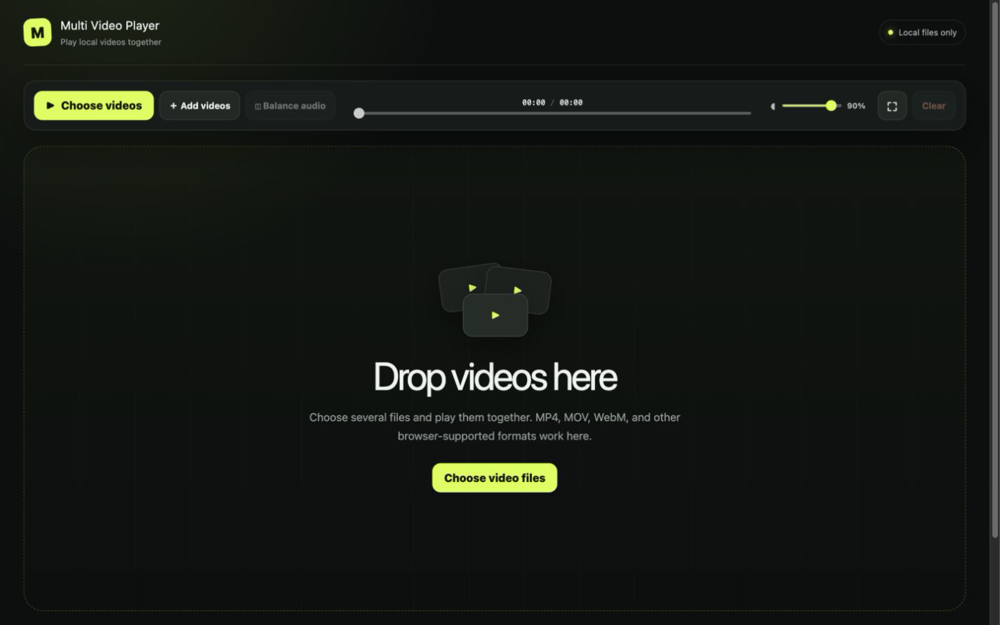
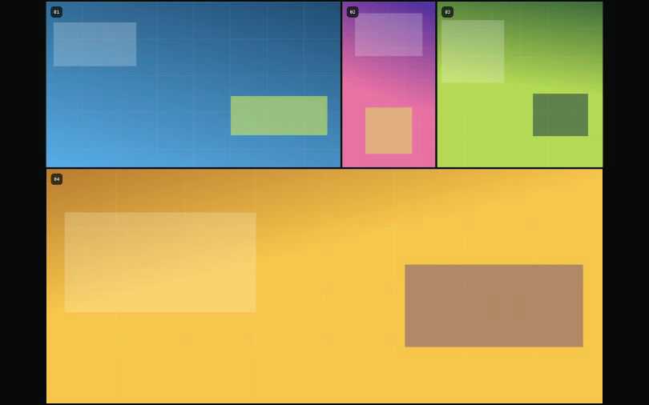

# Multi Video Player

Play local videos side by side on one timeline. Nothing is uploaded and no
account is needed.



Drop in any mix of landscape, portrait, square, or ultrawide clips. The player
keeps them in sync, loops shorter clips, and fits every frame without cropping.

## Screens

| Choose files | Play together | Fullscreen |
| --- | --- | --- |
|  |  |  |

## What it does

- One play button and timeline for every video
- Automatic layouts for mixed aspect ratios
- Per-video display sizes that keep halving or doubling until they reach a layout boundary
- Per-video volume, mute, solo, and audio balancing
- Fullscreen video wall
- Local-only playback

## Run it

Requires Node.js 22.13 or newer.

```bash
npm install
npm run dev
```

Open the local address printed in the terminal, then drop in your videos.
Format support depends on the browser; MP4, MOV, and WebM usually work.

## Development

```bash
npm test
npm run lint
```

## Improve the layout algorithm

Edit [`algorithm/video-layout.ts`](algorithm/video-layout.ts), then compare the
results before and after your change:

```bash
npm run test:layout
npm run benchmark:fill
```

`P05 fill` and `worst fill` should go up; `P95 black` should go down. The
benchmark generates 5,000 repeatable aspect-ratio combinations by default.

MIT licensed.
